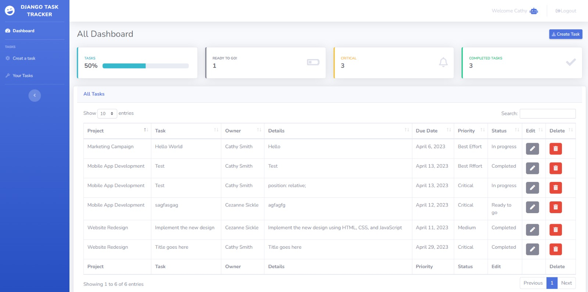

<!-- Improved compatibility of back to top link: See: https://github.com/othneildrew/Best-README-Template/pull/73 -->

<!-- PROJECT LOGO -->

<br />
<div align="center">
  <a href="https://github.com/Flying-Buddha/Django_Task_Tracker">
    
    <p align="center">Tracker Watchdog</p>
  </a>

<h3 align="center">Django_Task_Tracker</h3>

  <p align="center">
    Django application that serves as a development task-tracking portal. 
    <br />
    <a href="https://github.com/Flying-Buddha/Django_Task_Tracker">View Demo</a>
    ·
    <a href="https://github.com/Flying-Buddha/Django_Task_Tracker/issues">Report Bug</a>
    ·
    <a href="https://github.com/Flying-Buddha/Django_Task_Tracker/issues">Request Feature</a>
  </p>
</div>

<!-- TABLE OF CONTENTS -->

<details>
  <summary>Table of Contents</summary>
  <ol>
    <li>
      <a href="#about-the-project">About The Project</a>
      <ul>
        <li><a href="#built-with">Built With</a></li>
      </ul>
    </li>
    <li>
      <a href="#getting-started">Getting Started</a>
      <ul>
        <li><a href="#prerequisites">Prerequisites</a></li>
        <li><a href="#installation">Installation</a></li>
      </ul>
    </li>
    <li><a href="#contact">Contact</a></li>
  </ol>
</details>

## About The Project

[](https://example.com)

### Overview

Here's an image of the project dashboard which outlines all the basic requirements requested in the technical assesment.

### Description

This is a Django application that serves as a development task-tracking portal which allows users to create and manage a list of tasks.
I have included a Django-Jassmin admin page, to access the admin page see instruction below.

<p align="right">(<a href="#readme-top">back to top</a>)</p>

### Built With

    * Click on the icons/links below to see the build components source web pages.

* [](https://getbootstrap.com)
* [](https://jquery.com)
* [](https://www.djangoproject.com/)
* [](https://django-bootstrap-v5.readthedocs.io/en/latest/)
* [](https://pypi.org/project/django-bootstrap4/)
* [](https://pypi.org/project/django-userforeignkey/)
* [](https://pypi.org/project/django-bootstrap-datepicker-plus/)
* [](https://django-jazzmin.readthedocs.io/)
* [](https://pypi.org/project/pip/)
* [](https://pypi.org/project/pydantic/)
* [](https://pypi.org/project/beautifulsoup4/)
* [](https://pypi.org/project/setuptools/)
* [](https://pypi.org/project/sqlparse/)
* [](https://pypi.org/project/soupsieve/)

<p align="right">(<a href="#readme-top">back to top</a>)</p>

## Getting Started

Please follow the instructions below to clone and deploy a local Django Server and run your project

### Prerequisites

* This project was built on and requires Python Version 3.11

   [](https://www.python.org/downloads/release/python-3112/)

* If your using windows(x64) click the direct download link below to install the correct python version.

   [](https://www.python.org/ftp/python/3.11.2/python-3.11.2-amd64.exe)

### Installation

1. Clone the repo using the following gitbash command

   * git clone https://github.com/Flying-Buddha/Django_Task_Tracker.git

2. Navigate into the local cloned directory "Django_Task_Tracker" and open the project in your prefered Editor

   * (Pycharm / VsCode recomended)

3. Prepare your environment by setting up a new virtual environment.

   * In the terminal window run the following commands manually or simply click the Run button in the cell below to setup your project automatically.(run/ execute button appears on mouse over)

```sh
python -m venv env
source env/Scripts/activate.ps1
pip install -r requirements.txt
pip install django-jazzmin
pip install -U django-jazzmin
python manage.py makemigrations
python manage.py migrate
python manage.py runserver


```

4. In your terminal once you see the "Starting Development Server at https://127.0.0.1:8000/ ,  double click on the hyper link to launch app into your brower.
   * Alternatively click here: https://127.0.0.1:8000/

<p align="right">(<a href="#readme-top">back to top</a>)</p>

## Contact

Cezanne SIckle - [@LinkedIn Profile](https://www.linkedin.com/in/cezannesickle/) - cezanne.sickle7@gmail.com

Project Link: [https://github.com/Flying-Buddha/Django_Task_Tracker](https://github.com/Flying-Buddha/Django_Task_Tracker.git)

<p align="right">(<a href="#readme-top">back to top</a>)</p>
